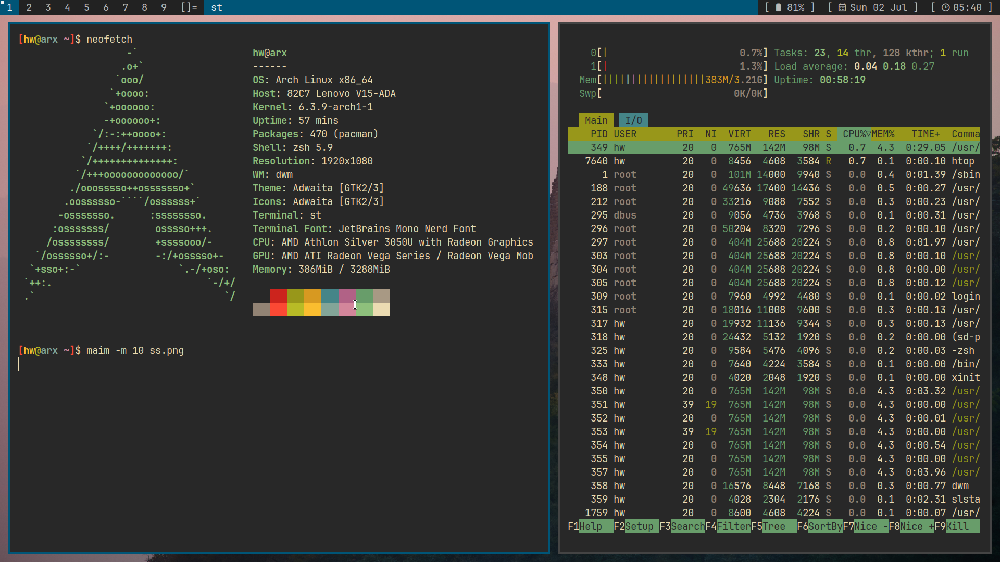

# HARBS

| Type                | Choice         |
| ------------------- | -------------- |
| Shell               | ZSH           |
| Color scheme        | Manual |
| Distribution        | ARCH     |
| Windows Manager    |  DWM      |
| IDE                 | Neovim, VSCode |
| Web Browser         |  Brave     |
| Terminal            | Alacritty  & st   |
<div align="center">
<h3> Dotfiles⚡💞️ <h3>



<br>

</div>
- its recommended to install on fresh arch install but it will work otherwise 


  
#### Steps to Install My Configaration 

```yaml
$ mkdir suckless 
$ cd suckless/
$ git clone git://github.com/singh-vikal/harbs
$ cd harbs/
$ sudo chmod +x install.sh
$ ./install.sh
```
Now Sit Back and Relax. You just have to select Yes at some places and this script will give you a beautiful Dwm setup with dmenu, st, alacritty, slstatus, Brave browser, mpv, audio setup, and other daily required packages.


#### Links 

 - [Dynamic Window Manager (DWM)](https://dwm.suckless.org/)
 - [Suckless](https://suckless.org/)
 - [Simple Terminal](https://st.suckless.org/)
 - [DMenu](https://tools.suckless.org/dmenu/)

I don't have comments as I don't want to manage them. You can however contact me at the below address if you want to.

 - [Mail](mailto:singhvikal891@gmail.com)

#### Credit:
 - [Harsh/Sei](https://github.com/seicq)
 - [Me](https://github.com/singh-vikal)
